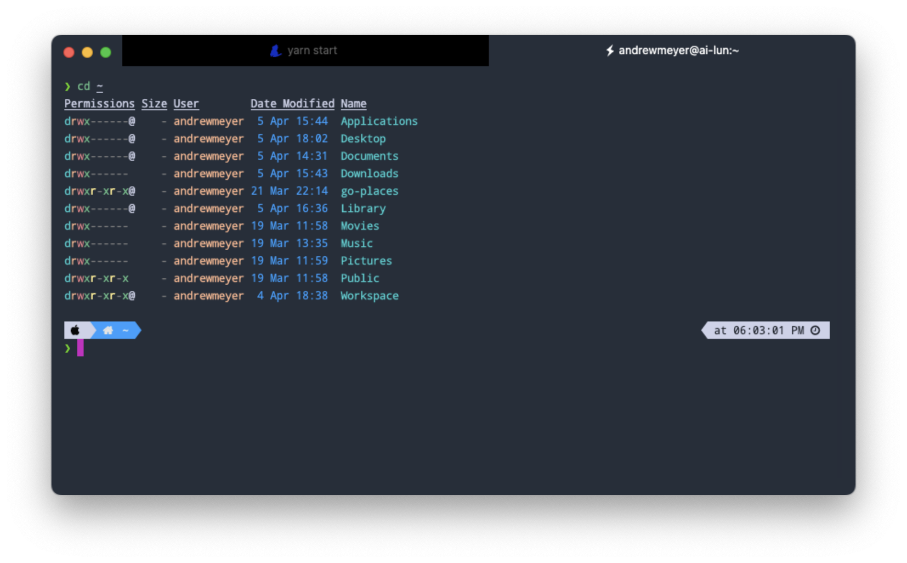

Yes. It's an inappropriate title. I should change it...

In the mean time, I can sort of obsess over my tools: my keyboard, my monitor, my chair, my computer, my IDE, my terminal experience, ... etc, etc. I think it's pretty normal. As part of this is that I like my terminal to be **👌 NICE 👌**. Over the years I have had a few iterations of config. I decided I would write out what I do for myself in the future but also for anyone who may be curious. Here's my setup.

## Terminal app

IMHO, there is really one clear winner ...and one fan favorite. In general, I use [iTerm2](https://iterm2.com/). It is powerful, reliable, and supports a lot of config if you want to make it just right. This is really the right choice for most people. If in doubt, use this.

For my fan favorite pick, I like [hyper adsf asdf asdf asd asdf asdf ](https://hyper.is/). Hyper is an electron-based terminal emulator. What's nice about it is the ability it gives you to customize exactly how it looks. For some, this probably is unnecessary, but for me it's a lot of fun.

Choose iTerm for the sensible choice; choose hyper for fun.

## Shell to use

## Config

## Themes and such

## Wrap up